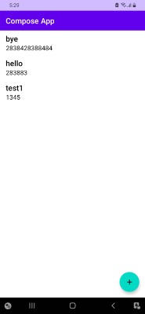
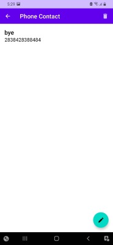
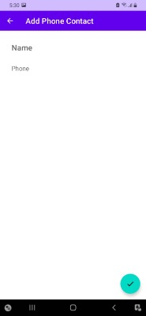

User stories
=================

User stories for compose app.

User story 01
-----------

As an user, I want to access the contact information of all my friends, so that I can review it
anytime I want.

User story 02
-----------

As an user, I require to view the details from any particular contact, so that I can take actions
based on that data.

User story 03
-----------

As an user, I would like to manage the information of my contacts, so that always is up to date.

